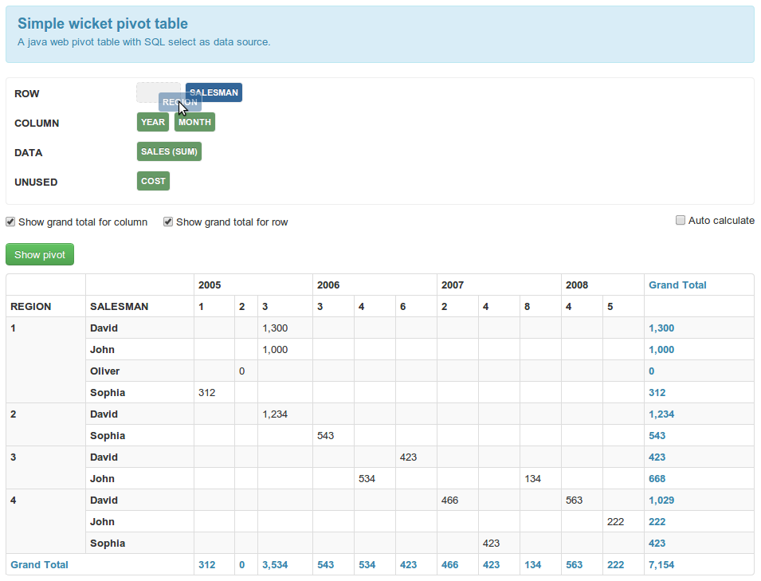

Simple wicket pivot table
=====================
A pivot table is a data summarization tool found in data visualization programs such as spreadsheets or business intelligence software.
For more information what it's a pivot table see http://en.wikipedia.org/wiki/Pivot_table.  

Current build status: [](https://buildhive.cloudbees.com/job/decebals/job/wicket-pivot/)



Components
-------------------
- **PivotDataSource** is the data source for pivot table (pivot's fields). The data can be fetched from a sql ResultSet (see ResultSetPivotDataSource) 
or other non sql sources.
- **PivotModel** is the place where I put the pivot configuration, here I can specify what fields are on each area (ROW, COLUMN, DATA)
and what is their ordering. Also, here I can mention if I want a grand total on rows and/or columns.
- **PivotTable** is the component that displays the pivot and it takes a PivotModel object as parameter.
- **PivotField** is the object that can be put on a pivot's area. This object has a name and an index. 
As a constraint, on pivot's data area must be minimum one field and minimum one field on row or column areas.
Also on aria DATA you can put only fields with Number type. 
The pivot fields allow several types of aggregations including sum, average, min, max, count. 
- **PivotExporter** is the interface for the pivot exporter plugins (builtin support for Csv and Xls)

Artifacts
-------------------
- Wicket Pivot `wicket-pivot` (jar)
- Wicket Pivot Demo `wicket-pivot-demo` (war)

Using Maven
-------------------
In your pom.xml you must define the dependencies to Wicket Pivot artifacts with:

```xml
<dependency>
    <groupId>ro.fortsoft.wicket.pivot</groupId>
    <artifactId>wicket-pivot</artifactId>
    <version>${wicket-pivot.version}</version>
</dependency>    
```

where ${wicket-pivot.version} is the last wicket-pivot version.

You may want to check for the latest released version using [Maven Search](http://search.maven.org/#search%7Cga%7C1%7Cwicket-pivot)

How to use
-------------------
It's very simple to add a pivot table in your wicket application.

```java
PivotDataSource pivotDataSource = ...;      
add(new PivotPanel("pivot", pivotDataSource));
```

First of all you must create a PivotDataSource and secondly add the pivot panel in your page.

If you want to add programmatically some fields on the pivot areas

```java
pivotModel.getField("REGION").setArea(PivotField.Area.ROW);
pivotModel.getField("SALESMAN").setArea(PivotField.Area.ROW).setAreaIndex(1);
pivotModel.getField("YEAR").setArea(PivotField.Area.COLUMN);
pivotModel.getField("MONTH").setArea(PivotField.Area.COLUMN).setAreaIndex(1);
pivotModel.getField("SALES").setArea(PivotField.Area.DATA);
```

You can specify an aggregator for a data pivot field

```java
pivotModel.getField("SALES").setAggregator(Aggregator.get(Aggregator.COUNT));
```    

or 

```java
pivotModel.getField("MONEY").setAggregator(new Aggregator.Count());
```

You can specify a custom converter (wicket `IConverter`) for a field

```java
pivotModel.getField("SALES").setConverter(new DoubleConverter() {

    @Override
    public NumberFormat getNumberFormat(Locale locale) {
        NumberFormat format = super.getNumberFormat(locale);
        format.setMinimumFractionDigits(2);

        return format;
    }

});
```   

If you don't set a converter for a field then this field (the values) will be rendered 
with a converter supplied by wicket according to the field type.

If you want to display programmatically a grand total on rows and/or columns

```java
pivotModel.setShowGrandTotalForColumn(true);
pivotModel.setShowGrandTotalForRow(true);
```
    
Also, Wicket Pivot has support for Field calculations, e.g: 

- % fieldA of fieldB (PercentOf); when you need to display how much % are the costs from the revenue. I.e. how much % of our revenue do we give to Google
- field A + fieldB (Addition)
- fieldA - fieldB (Substract)

Another nice feature is auto calculate (a check box component). When you check this feature than on each pivot modifications (area, aggregation, etc) you can see the result in real time.

Internationalization
-------------------
Wicket-pivot has support for internationalization. 
Supported languages:
- English
- German
- Romanian
 
If you want support for another languages please create and send a pull request (or an email) with the translation of [wicket-package.properties](https://github.com/decebals/wicket-pivot/blob/master/wicket-pivot/src/main/java/ro/fortsoft/wicket/pivot/wicket-package.properties).

Demo
-------------------
I have a tiny demo application with a demo apache derby embedded database. The demo application is in demo package.
To run the demo application use:  
 
```bash
mvn install
cd demo
mvn jetty:run
```

In the internet browser type http://localhost:8081/.

In demo pivot page put some fields on the areas (for example "REGION", "SALESMAN" on ROW area, "YEAR", "MONTH" 
on COLUMN area and "SALES" on DATA area) and press the "Show pivot" button.

You can see a screenshot from demo application in [wiki page] (https://github.com/decebals/wicket-pivot/wiki).

Versioning
------------
Wicket-pivot will be maintained under the Semantic Versioning guidelines as much as possible.

Releases will be numbered with the follow format:

`<major>.<minor>.<patch>`

And constructed with the following guidelines:

* Breaking backward compatibility bumps the major
* New additions without breaking backward compatibility bumps the minor
* Bug fixes and misc changes bump the patch

For more information on SemVer, please visit http://semver.org/.

License
--------------
Copyright 2012 Decebal Suiu
 
Licensed under the Apache License, Version 2.0 (the "License"); you may not use this work except in compliance with
the License. You may obtain a copy of the License in the LICENSE file, or at:
 
http://www.apache.org/licenses/LICENSE-2.0
 
Unless required by applicable law or agreed to in writing, software distributed under the License is distributed on
an "AS IS" BASIS, WITHOUT WARRANTIES OR CONDITIONS OF ANY KIND, either express or implied. See the License for the
specific language governing permissions and limitations under the License.
